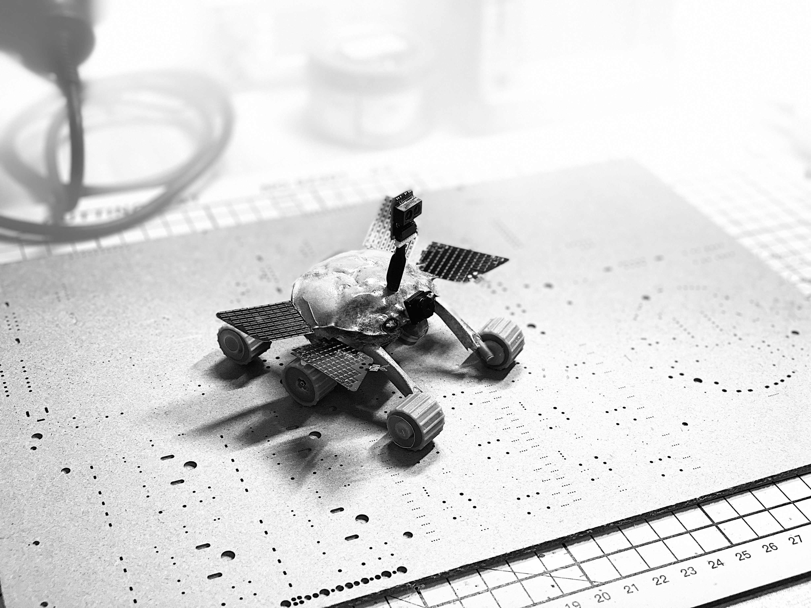

# MiniRover-Hardware
> 自制火星车的开源资料。
>
> **注意**：原仓库目前是Android APP的源码，硬件相关的文件移到本仓库。

演示视频：https://www.bilibili.com/video/BV1ZA411e7Ff

## 文件结构说明

* **Hardware**：source里面是电路原理图和PCB文件，使用Altium Designer打开；release里面是gerber文件可以直接发给厂家打样，也包含了元器件BOM表。
* **Firmware**：ESP32的固件源码，包括Camera的驱动、jpeg-stream的web-server、电机驱动、ToF的ADC读取等等。
* **Android**：一个用于和ESP32通信并通过WiFI图传显示在手机上的Android Sample代码，不是视频中演示的那个APP，**视频中演示的APP源码整理出来挪到了原仓库**。
* **Docs**：相关IC的Datasheet。

## 关于MCU方案

ESP32是乐鑫继ESP8266后推出的另一款32位集成WiFi功能的微控制器，比ESP8266强大很多，可以用来开发更加复杂的应用。本项目中使用的是`ESP32-PICO D4`，该芯片具有下列特点：

- WiFi支持 802.11 b/g/n，802.11 n (2.4 GHz) 速度高达 150 Mbps；
- 支持蓝牙 v4.2 完整标准，包含传统蓝牙 (BR/EDR) 和低功耗蓝牙 (BLE)；
- 32位双核处理器，CPU正常工作速度为80MHz，最高可达240MHz，运算能力高达 600 MIPS；
- 内置 448 KB ROM；
- 内置520 KB SRAM；
- 最大支持 16 MB 片外 SPI Flash；
- 最大支持 8 MB 片外 SPI SRAM；

ESP32开发方式蛮多样的，下面几个是比较常用的：

- 乐鑫官方ESP-IDF，这是官方的首推的开发方式，能够最大限度发挥ESP32的性能，代价就是开发不那么高效；
  https://docs.espressif.com/projects/esp-idf/zh_CN/stable/
  https://github.com/espressif/esp-idf/releases
- 乐鑫官方出品`Arduino core for the ESP32`，官方出品的Arduino支持，相比前一个性能虽然打折，但是用来尝鲜还是非常不错的，上手简单：
  https://github.com/espressif/arduino-esp32
- 其他方式例如`MicroPython`、`NodeMCU`等等。

我在项目中是使用Arduino的方式，采用Visual Studio的Arduino插件开发。